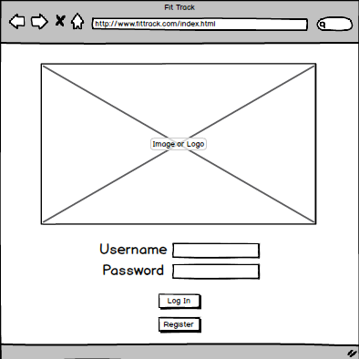
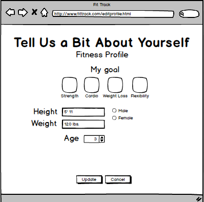
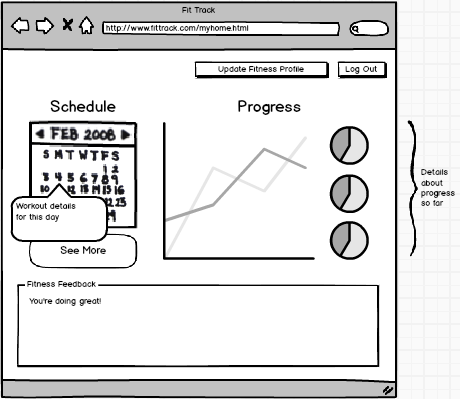

<h1>Fit Track</h1>

<h2>Problem Statement</h2>
Most people lose track of their goals for workouts. If they miss a day, they are more likely to fall into a lull.

<h2>How do you solve the problem?</h2>
Fit Track provides a fitness plan and serves a reminder to keep you on track. It is personalized, keeping track of your progress and serving personalized suggestions.

<h2>Features</h2>
Users create fitness profile 
Enter fitness goal (eg. weight loss, strength) 
View plan for next workout session
View workout schedule
Track progress with graphs 

<h2>Pick 5</h2>
Server-side data persistence 
Client-side data persistence 
Front-end framework (TBD) 
Reporting with charts and graphs 
Sending emails and/or SMS

<h2>Data Collection</h2>
User login credentials 
Basic fitness profile (height/weight etc.) 
Past workouts 
Connections with other users 

<h2>APIs</h2>
Google Graphs API 
Gmail API

<h2>Algorithms</h2>
Fitness plan selection based on user profile 
Determining feedback based on progress

<h2>Markups</h2>

#Comments by Ming
* What you listed for features are not features.  Features are what the users do in your app (e.g., enter fitness profile)
* What APIs will you be using?
